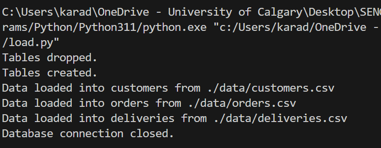
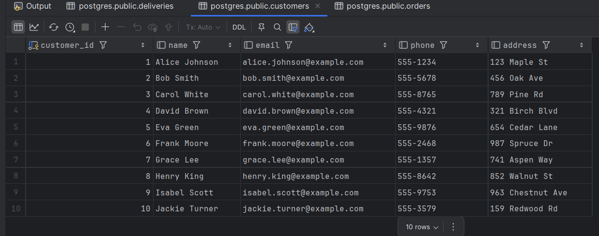
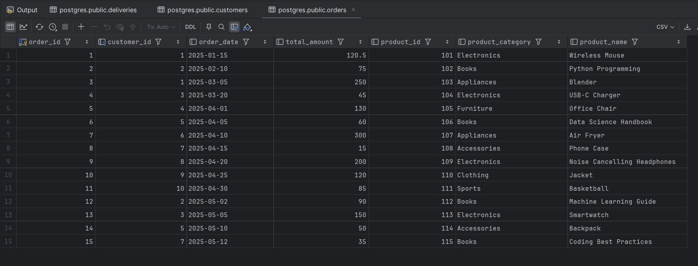
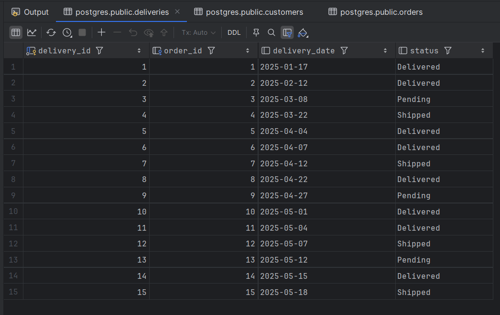

# Assignment 1

Code is separated by the different parts of the assignments.

## Load.py

The load.py file is seperated into different functions for code reusability, and seperating the code for each part.

### General functions

```Python
def load_csv_to_db(file_path:str, table_name:str, columns:list) -> None
```

Load a csv file to the defined Postgres database. Takes the file path, table name, and defined columns within the table as inputs.

```Python
def reset_tables(tables: list) -> None
```

Drops tables given as input, if they exist within Postgres.

```Python
def create_tables() -> None
```

Runs the "CreateDB.sql" script to create Postgres tables.

## Part 2

### load.py

The part 2 code is stored in the function ` part2Code()`, this function:

1. Resets the tables present (if they exist) by calling ` reset_tables()`
2. Runs the CreateDB script by calling ` create_tables()`
3. Loads csv data by calling `load_csv_to_db()` three times for the tables:
   1. customers
   2. orders
   3. deliveries

### Screenshots

The console logs after running part 2 is:


**The initial states of the tables are shown below.**

#### Customers



#### Orders



#### Deliveries



## Part 3

The Part 3 functions are found in `load.py`

### load.py

The part 3 code is split into 2 functions, `part3Code()` that holds operations 1-4, and 6, and `part3_1Code()` which performs step 5. This includes adding a new customer, order, and delivery.

## Part 4

All part 4 code is found in their individual `.sql` and `.png` files.

## Part 5

Part 5 code, two new schemas are found in `Part5.sql`.

### addresses

This new table would change the existing customers table by adding a new foreign key referencing the "address_id" column in the new table.

### payments

This new table would change the existing orders table by adding a new foreing key referencing the "payment_id" column in the new table.
